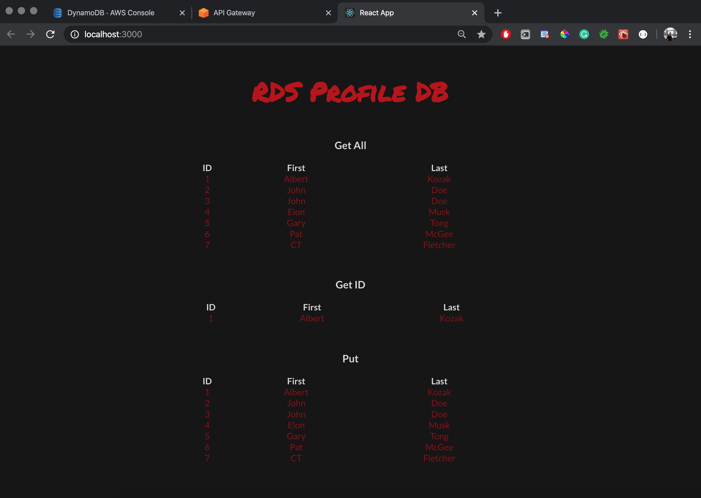
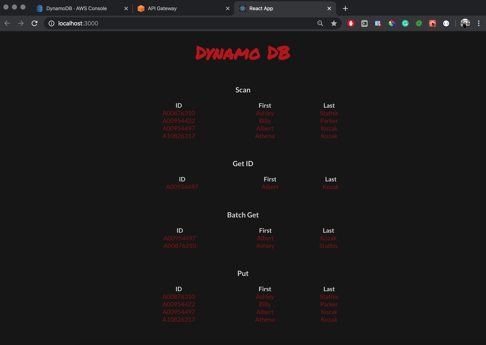
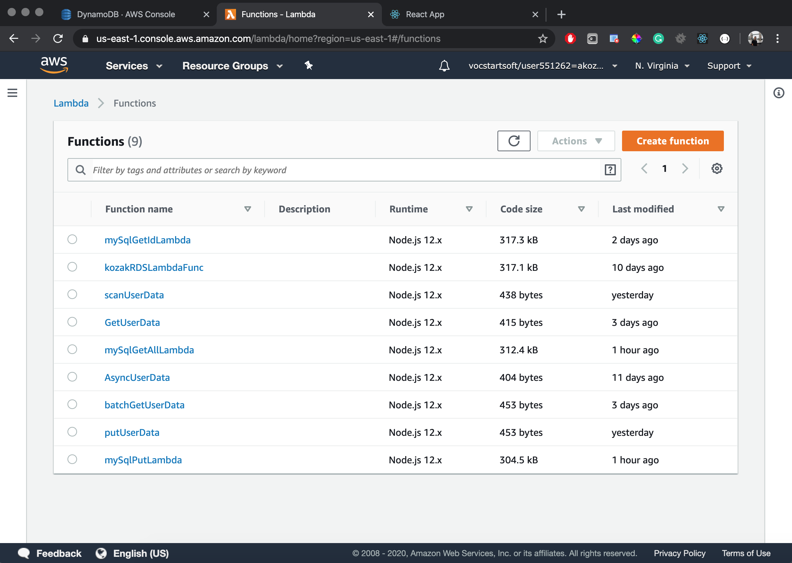
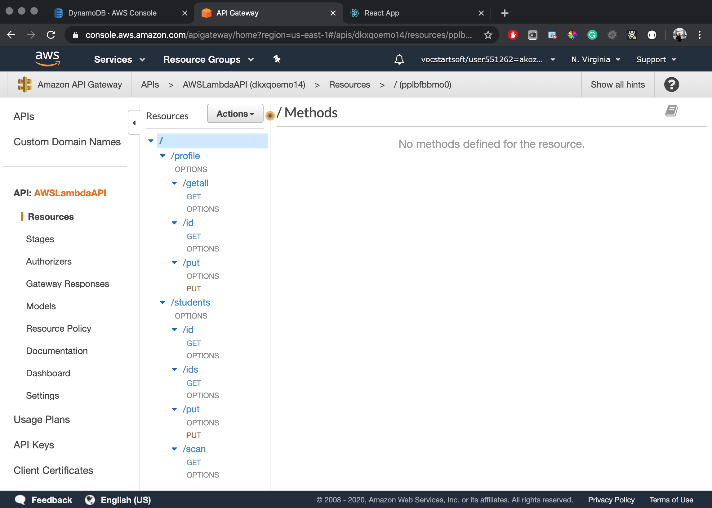

# AWS API Gateway

### Technologies: React 
#### AWS API Gateways+ Lambda Functions interacting with DynamoDB & RDS - MySQL Databases

**Purpose:**
  * Highlights AWS functionality blended with different DBs and comparing differences / similarities in Lambda functions to interact with one another

**Instructions:**
  * Download or clone this repo
  * CD to the project folder via terminal
  * Run the command " _npm install_ " followed by " _npm start_ "
  * View in _http://localhost:3000/_

**Example #1:**

**Example #2:**

**Lambda Functions:**

**API Gateway:**

